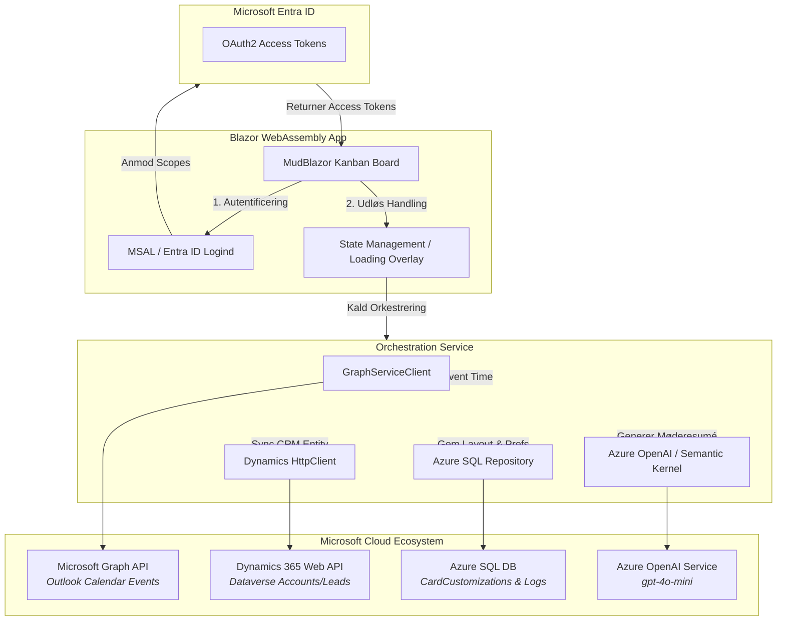

# Arkitektonisk Design & Tech Stack: AIDA-M365

Dette dokument beskriver den tekniske arkitektur og teknologiske sammensætning for **AIDA-M365 (Strategic Event Command Center)**. Systemet er designet som en højtydende, integreret platform, der samler og orkestrerer data på tværs af Microsoft 365-økosystemet, Dynamics 365 og Azure.

---

## 🏗️ Systemarkitektur

AIDA-M365 fungerer som en central "Hub", der forbinder frontend-brugerfladen med flere underliggende cloud-tjenester i realtid. Systemet sikrer atomiske opdateringer på tværs af Microsoft Graph, Dynamics 365 og Azure SQL.

---

## 💻 UI Framework & Frontend

* **Blazor WebAssembly (WASM) / C# 12 & .NET 8/9**
  * **Hvorfor:** Giver mulighed for at bygge en rig, interaktiv Single Page Application (SPA) ved hjælp af C# i stedet for JavaScript. Dette sikrer fuld typesikkerhed og mulighed for at dele datamodeller direkte mellem frontend og backend.
* **MudBlazor (Komponentbibliotek)**
  * **Hvorfor:** Leverer et moderne Material Design-brugerfladedesign.
  * **Nøglekomponent:** `MudDropContainer` bruges til at bygge Kanban-boardet, hvilket giver en flydende drag-and-drop oplevelse, hvor kolonner repræsenterer tidsintervaller eller Dynamics-eventkategorier.

---

## 🔐 Identitet & Sikkerhed (Microsoft Entra ID)

Systemet anvender **Microsoft.Identity.Web** (MSAL.NET) til Single Sign-On (SSO) og tokenadministration.
* **Godkendelsesmodel:** OAuth 2.0 Authorization Code Flow med PKCE.
* **Påkrævede Scopes (Rettigheder):**
  * `Calendars.ReadWrite`: Giver applikationen tilladelse til at læse og ændre brugerens Outlook-kalenderaftaler direkte under drag-and-drop handlinger.
  * `https://[org].crm.dynamics.com/user_impersonation`: Giver applikationen tilladelse til at udføre handlinger i Dynamics 365/Dataverse på vegne af den loggede bruger.

---

## 🔌 Datakilder & Integrationer (Hub-Modellen)

AIDA-M365 fungerer som en orkestrator, der synkroniserer tre adskilte datakilder:

### 1. Primær Datakilde: Microsoft Graph API
* **Formål:** Synkronisering af Outlook-kalenderbegivenheder.
* **Teknisk implementering:** Anvender `GraphServiceClient` i .NET. Når et kort flyttes på Kanban-boardet, beregner systemet den nye UTC-tid og sender en `PATCH`-anmodning til `/me/events/{id}` for at opdatere kalenderen i realtid.

### 2. Sekundær Datakilde: Dynamics 365 (Dataverse Web API)
* **Formål:** At forbinde kalenderbegivenheder til CRM-enheder såsom `Accounts`, `Leads` eller `Opportunities`.
* **Teknisk implementering:** En tilpasset C# `HttpClient`, der kommunikerer med OData v4 REST-endpointet i Dynamics 365. Ved drag-and-drop opdateres relaterede CRM-entiteter synkront.

### 3. Persistent Lag: Azure SQL Database
* **Formål:** Lagring af metadata, som ikke kan gemmes i M365 eller Dynamics (f.eks. kortfarver, brugerpræferencer, historiske audit-logs).
* **Teknisk implementering:** En letvægts **Dapper**- eller **EF Core**-integration, der forbinder til en omkostningsoptimeret Azure SQL Database (Basic DTU-tier eller Serverless vCore med auto-pause). Anvender *Repository Pattern* for at holde Blazor-komponenterne decoblede.

---

## 🤖 Kunstig Intelligens (Azure AI / OpenAI)

* **Model:** **`gpt-4o-mini`** via **Azure OpenAI Service** (S0 Tier, Global Standard).
* **Integration:** Forbundet via det officielle **Azure.AI.OpenAI** SDK eller **Semantic Kernel**.
* **Funktioner:**
  * **Smart Summarize:** En knap på hvert kort sender kalenderbegivenhedens HTML/tekst-beskrivelse til Azure OpenAI, som returnerer et struktureret resumé samt konkrete handlingspunkter (action items).
  * **Intelligent Time-slot & Column Suggestion:** Analyserer mødebeskrivelser for at foreslå den optimale Kanban-kolonne eller det bedste tidspunkt baseret på mødets prioritet og kontekst.

---

## ⚙️ State Management & Transaktionslogik

For at forhindre inkonsistente data på tværs af de tre platforme (Outlook, Dynamics, Azure SQL) under en drag-and-drop handling, anvender AIDA-M365 følgende mønster:

1. **Visuel Låsning (Loading Overlay):** UI fryses med en MudBlazor-indlæsningsindikator for at forhindre yderligere handlinger, mens opdateringen er i gang.
2. **Atomisk Orkestrering:** Orkestreringstjenesten forsøger at opdatere Microsoft Graph og Dynamics 365 sekventielt.
3. **Automatisk Rollback:** Hvis en af cloud-tjenesterne fejler (f.eks. netværksfejl eller manglende rettigheder), rulles den lokale UI-tilstand automatisk tilbage til de oprindelige værdier, og brugeren præsenteres for en fejlmeddelelse.
