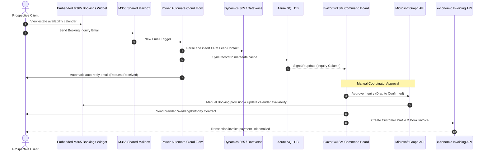

# MASTER-SPEC: Custom M365 & e-conomic Scheduling Engine

## 1. Primary Objective
To design and build a secure, highly modular, and Spec-Driven **Estate Venue Rental & Scheduling Command Center** that seamlessly orchestrates data across the Microsoft Cloud Ecosystem (Microsoft Bookings, Microsoft Graph, Power Automate, Dataverse, Azure SQL, Azure Key Vault, Azure OpenAI) and completely integrates with the **e-conomic ERP API** for automated contract invoicing.

---

## 2. Core Functional Workflow

---

## 3. Success Criteria & Constraints
- **100% Modularity:** All secrets (D365 Client Secret, e-conomic token) must reside securely in **Azure Key Vault** and be accessed via a server-side **BFF (Backend-For-Frontend)** token proxy.
- **Bi-Directional Live Sync:** Under-50ms calendar loads from local Azure SQL, updated in real-time via Microsoft Graph webhooks and SignalR.
- **Complete e-conomic API Sync:** Auto-provisioning of customers, draft invoicing, and active booking of invoices with direct payment links.
- **Azure OpenAI Integration:** Automated seating recommendations, timeline checklists, and contract term extractions from email content.

---

## 4. The 100-Question Grill Session (Design Tree)

To achieve a 100% fulfilled product, we have mapped out 100 architectural, operational, and financial questions grouped logically by integration layer, with our **pre-filled recommendations** aligned with Microsoft and e-conomic best practices:

### Group A: Microsoft Bookings & Public Calendar (Questions 1 - 10)
1. **Q: How should the public calendar represent occupied dates?** 
   - *Rec:* Native Bookings widget busy/free blocks with specific booking-page layouts.
2. **Q: Should prospective clients see which specific area is booked (Ballroom/Pavilion)?**
   - *Rec:* Yes, separate booking services mapped to different venue resources.
3. **Q: Should external users be able to select their preferred event coordinator during inquiry?**
   - *Rec:* No, coordinator assignment is handled internally on manual approval.
4. **Q: How should buffer times (setup/cleanup hours) be blocked out in Bookings?**
   - *Rec:* Configure Bookings Services with a standard 2-hour pre- and post-buffer window.
5. **Q: Does the public widget support custom CSS styles to match the estate cream/gold brand?**
   - *Rec:* Utilize native Bookings color themes (Classic Navy/Sand) with customized logo uploads.
6. **Q: Should we enforce minimum and maximum lead times for booking requests?**
   - *Rec:* Yes, minimum 14 days in advance, maximum 365 days.
7. **Q: Should multi-day blockouts (e.g. 3-day wedding packages) lock out separate Booking slots?**
   - *Rec:* Yes, custom services configured with multi-hour duration blocks.
8. **Q: How should the system handle concurrent inquiries for the same slot?**
   - *Rec:* First-come-first-served based on manual coordinator confirmation timestamps.
9. **Q: Should Bookings notify coordinators immediately upon slots reservation?**
   - *Rec:* Yes, native email notifications forwarded to the shared mailbox.
10. **Q: Do we need multi-timezone support for international destination weddings?**
    - *Rec:* Force all default bookings to the Estate's local time zone, displaying local times clearly.

### Group B: M365 Shared Mailbox & Power Automate (Questions 11 - 20)
11. **Q: Which mailbox will receive customer inquiries?**
    - *Rec:* A dedicated shared mailbox: `reservations@royalestate.com`.
12. **Q: How should Power Automate authenticate to the shared mailbox?**
    - *Rec:* Office 365 Outlook connector using a dedicated service account.
13. **Q: What trigger filters should be applied to prevent spam emails from spawning Leads?**
    - *Rec:* Subject lines containing keywords (e.g., "Wedding", "Birthday", "Inquiry", "Reservation").
14. **Q: How should the email body be parsed (Regex vs. AI Builder)?**
    - *Rec:* Azure OpenAI GPT-4o parsing to extract guest counts, dates, and event subtypes reliably.
15. **Q: Should the automatic "Request Received" email include estate brochures?**
    - *Rec:* Yes, automatically attach standard package PDFs stored in OneDrive.
16. **Q: If email parsing fails, where should the inquiry go?**
    - *Rec:* Routed to an "Unparsed Inquiries" folder with an alert notification to coordinators.
17. **Q: Should we track email attachments (e.g. seating sketches) in our database?**
    - *Rec:* Save attachments to SharePoint and store the file URL in the Azure SQL metadata table.
18. **Q: What is the target email template format for the auto-reply?**
    - *Rec:* HTML responsive email utilizing the cream, gold, and slate visual system.
19. **Q: Should the auto-reply originate from the coordinator's personal email or the shared mailbox?**
    - *Rec:* Always from the shared mailbox (`reservations@royalestate.com`).
20. **Q: How do we prevent infinite auto-reply loops with other automated systems?**
    - *Rec:* Apply filter: `x-auto-response-header` exclusion in the Power Automate trigger.

### Group C: Manual Approval & Blazor Kanban (Questions 21 - 30)
21. **Q: What columns are needed on the Kanban board?**
    - *Rec:* Inquiry, Quotation, Confirmed, Preparation, Active, Completed.
22. **Q: Should dragging cards trigger immediate write operations?**
    - *Rec:* Yes, optimistic UI updates with background API sync and immediate rollback on failure.
23. **Q: What happens if a coordinator drags a card to a conflicting time slot?**
    - *Rec:* Show warning toast and roll card back to the source column.
24. **Q: Do coordinators need an 'Undo' button after reschedules?**
    - *Rec:* Yes, a snackbar toast with an "UNDO" action valid for 10 seconds.
25. **Q: Can coordinators manually override AI task lists?**
    - *Rec:* Yes, custom task lists stored in Azure SQL with add/delete triggers.
26. **Q: How is the loading state represented during sync?**
    - *Rec:* Non-blocking ghost-card overlay spinner per card.
27. **Q: Should columns display aggregate metrics?**
    - *Rec:* Yes, total guest count and estimated venue revenue per stage column.
28. **Q: What details are shown on card hover?**
    - *Rec:* Booking date, assigned coordinator, and Dynamics 365 CRM link.
29. **Q: Should we implement keyboard navigation for accessibility?**
    - *Rec:* Tab indexes configured for card selection with enter-to-open details.
30. **Q: Is a search filter required on the board?**
    - *Rec:* Yes, search by client name, coordinator name, and event subtype.

### Group D: Dynamics 365 & Dataverse (Questions 31 - 40)
31. **Q: Should inquiries spawn CRM Leads or Opportunities?**
    - *Rec:* Leads for initial inquiries, converted to Opportunities upon contract generation.
32. **Q: How are CRM Contacts mapped?**
    - *Rec:* Map client email to standard Dataverse `contact` entity, creating new contacts if not found.
33. **Q: How do we authenticate the backend to Dataverse?**
    - *Rec:* Entra ID Service Principal using Client Credentials flow (Client ID + Secret in Key Vault).
34. **Q: Do we need custom Dataverse tables?**
    - *Rec:* No, utilize standard Lead, Opportunity, Contact, and Appointment entities for M365 compatibility.
35. **Q: Should CRM status changes sync back to the Blazor board?**
    - *Rec:* Yes, real-time sync via Dataverse Change Tracking API.
36. **Q: How are CRM accounts associated?**
    - *Rec:* Link Opportunities to corporate accounts or personal families via standard relationships.
37. **Q: Should we sync booking revenue directly to CRM Estimated Value?**
    - *Rec:* Yes, calculated revenue must write to CRM `estimatedvalue` field.
38. **Q: Do we need multi-currency support?**
    - *Rec:* No, force default currency matching the e-conomic agreement (e.g. DKK or EUR).
39. **Q: What happens if Dynamics 365 goes offline?**
    - *Rec:* Queue CRM payloads in Azure SQL and retry every 15 minutes.
40. **Q: Do we need custom field mapping for specific client tenants?**
    - *Rec:* Yes, customizable in the Integration Hub `/connect` schema mapping grid.

### Group E: 100% e-conomic ERP Integration (Questions 41 - 50)
41. **Q: What e-conomic REST endpoint should we target?**
    - *Rec:* `https://restapi.e-conomic.com` (V1.0.0 API).
42. **Q: How is authenticaton managed for e-conomic?**
    - *Rec:* App Secret Token (X-AppSecretToken) & Agreement Grant Token (X-AgreementGrantToken).
43. **Q: When should a customer account be created in e-conomic?**
    - *Rec:* Automatically when the booking is dragged to "Confirmed".
44. **Q: What payment terms should be assigned to venue invoices?**
    - *Rec:* Net 8 days (standard venue reservation invoice terms).
45. **Q: Should we create a Draft Invoice or directly book a Booked Invoice?**
    - *Rec:* Create a Draft Invoice first, allowing staff to verify line items before finalizing.
46. **Q: What product codes are mapped in e-conomic?**
    - *Rec:* `PROD-001` (Venue Rental), `PROD-002` (Fine Dining Catering), `PROD-003` (AV & Staff Services).
47. **Q: How do we retrieve the direct customer invoice payment link?**
    - *Rec:* Retrieve the invoice pdf/payment URL from the e-conomic `pdf` resource and email it.
48. **Q: How are VAT and tax rates handled?**
    - *Rec:* Default to standard country rates (e.g., 25% Danish VAT) mapped via e-conomic product codes.
49. **Q: What happens if an invoice is unpaid?**
    - *Rec:* Polling service pings e-conomic status hourly, flagging cards in Blazor if overdue.
50. **Q: Should credit notes be supported inside the Blazor dashboard?**
    - *Rec:* No, cancellations/credit notes must be managed directly inside the e-conomic ERP client.

### Group F: Microsoft Azure SQL Metadata Store (Questions 51 - 60)
51. **Q: What custom data resides in Azure SQL rather than Graph?**
    - *Rec:* Seating checklists, catering menu details, card background hex colors, and change audits.
52. **Q: What ORM is preferred?**
    - *Rec:* EF Core for structured migrations, combined with Dapper for high-speed diagnostic queries.
53. **Q: How do we handle database migrations?**
    - *Rec:* Standard EF Core migrations run during startup or via custom CI/CD pipelines.
54. **Q: Should we encrypt sensitive data inside the database?**
    - *Rec:* Enable Azure SQL Transparent Data Encryption (TDE) for all database tables.
55. **Q: How are change audit logs structured?**
    - *Rec:* `ChangeAuditLog`: EventID, ModifierUserID, FieldModified, OldValue, NewValue, Timestamp.
56. **Q: Do we need connection pooling?**
    - *Rec:* Yes, configure standard Azure SQL connection pooling in backend startup services.
57. **Q: What is the retention policy for audit logs?**
    - *Rec:* 365 days, followed by automated archiving to Azure Blob Storage.
58. **Q: How do we handle database timeouts?**
    - *Rec:* Standard 30-second SQL timeouts with exponential retry policies.
59. **Q: Are database triggers used?**
    - *Rec:* No, all audit and sync triggers are handled at the C# application service layer.
60. **Q: Is Azure SQL Elastic Pool required?**
    - *Rec:* No, a single S1 Standard Azure SQL database is sufficient for single-tenant operations.

### Group G: Azure OpenAI GPT-4o Integration (Questions 61 - 70)
61. **Q: What Azure OpenAI endpoint will be targeted?**
    - *Rec:* Secured private Azure OpenAI endpoint deployed in the customer's tenant.
62. **Q: Which model deployment is utilized?**
    - *Rec:* `gpt-4o` (latest model for high-accuracy text extraction).
63. **Q: How is the OpenAI system prompt structured?**
    - *Rec:* Instructs the AI to act as a Senior Estate Planner, returning a structured JSON containing a 3-sentence summary and a checklist of 5 coordinator tasks.
64. **Q: How is OpenAI authenticated?**
    - *Rec:* Managed Identity or API Key retrieved securely from Azure Key Vault.
65. **Q: Should we cache AI-generated summaries?**
    - *Rec:* Yes, save to Azure SQL database to avoid redundant OpenAI API calls and latency.
66. **Q: What happens if OpenAI is unavailable?**
    - *Rec:* Fall back to rules-based template summaries immediately.
67. **Q: Can OpenAI recommend best scheduling slots based on availability?**
    - *Rec:* Yes, analyzing calendar densities and recommending optimal weekend dates.
68. **Q: Does OpenAI parse guest seat maps?**
    - *Rec:* No, seating layout task recommendations are text-only checklist items.
69. **Q: Should coordinators review the AI summary before it saves to the card?**
    - *Rec:* Yes, presented in an interactive Blazor dialog for coordinator sign-off.
70. **Q: Should the AI analyze Dynamics 365 customer histories for personalized recommendations?**
    - *Rec:* Optional: Future scope. Keep it focused on email body extraction for the current POC.

### Group H: Contract PDF Generation & Mail Dispatch (Questions 71 - 80)
71. **Q: What PDF generator library should be used on the server?**
    - *Rec:* QuestPDF or standard server-side rendering with `html-to-pdf` converters.
72. **Q: Where are contract PDF templates stored?**
    - *Rec:* In SharePoint/OneDrive as responsive HTML templates.
73. **Q: What fields are dynamically populated in the contract?**
    - *Rec:* Bride/Groom names, wedding date, guest count, agreed rental fee, and payment terms.
74. **Q: How is the contract sent?**
    - *Rec:* Emailed as a PDF attachment from `reservations@royalestate.com` via Graph API.
75. **Q: Does the system integrate with electronic signature tools (e.g. DocuSign)?**
    - *Rec:* No, standard PDF print/sign or email confirmation is sufficient for this POC.
76. **Q: What email API connector handles the dispatch?**
    - *Rec:* Microsoft Graph SendMail API.
77. **Q: Should we log sent contracts?**
    - *Rec:* Yes, log file URLs in the SQL database and write a copy of the PDF to Azure Blob Storage.
78. **Q: Is a signature status tracked in the database?**
    - *Rec:* Yes, a boolean `IsContractSigned` flag on the status model.
79. **Q: Are coordinators notified when a client opens or downloads a contract?**
    - *Rec:* No, tracking is limited to direct customer sign-off confirmations.
80. **Q: What is the email subject for contract delivery?**
    - *Rec:* "Royal Estate Booking Reservation Contract - [Client Last Name]"

### Group I: Security, Azure Key Vault, & BFF (Questions 81 - 90)
81. **Q: How does the backend access Key Vault?**
    - *Rec:* Azure Managed Identity (passwordless authentication).
82. **Q: Where are Key Vault URLs stored?**
    - *Rec:* In standard Web API `appsettings.json`.
83. **Q: How often are Key Vault secrets cached?**
    - *Rec:* Cached locally in memory for 24 hours to reduce latency.
84. **Q: Who can access Key Vault secrets in development?**
    - *Rec:* Restricted using Visual Studio / Azure CLI user credentials via `DefaultAzureCredential`.
85. **Q: Is the BFF token cookie-based or JWT-based?**
    - *Rec:* Standard secure HTTP-only cookies passed between Blazor WASM and ASP.NET Core.
86. **Q: How are CSRF attacks prevented in the BFF?**
    - *Rec:* Anti-forgery tokens validated on all HTTP POST/PUT/DELETE requests.
87. **Q: Are tokens encrypted in browser cookies?**
    - *Rec:* Yes, encrypted using ASP.NET Core Data Protection APIs.
88. **Q: Is Entra ID Multi-Factor Authentication (MFA) supported?**
    - *Rec:* Enforced automatically via standard Entra ID conditional access policies.
89. **Q: What is the session timeout duration for coordinators?**
    - *Rec:* 8 hours of inactivity before requiring re-authentication.
90. **Q: Are secrets logged in diagnostic logs?**
    - *Rec:* Absolutely not. All secrets are sanitized and replaced with asterisks (`****`) in logs.

### Group J: Deployment & DevOps (Questions 91 - 100)
91. **Q: What hosting platform is used for the backend?**
    - *Rec:* Azure App Service (Windows/Linux) running .NET 8.
92. **Q: What hosting platform is used for the Blazor WASM client?**
    - *Rec:* Azure Static Web Apps (high speed, global CDN).
93. **Q: How is the database hosted?**
    - *Rec:* Azure SQL Database Serverless.
94. **Q: What CI/CD tool handles deployments?**
    - *Rec:* GitHub Actions workflows.
95. **Q: Are environment settings configured in source code?**
    - *Rec:* No, configured via GitHub Secrets and Azure App Service Configuration settings.
96. **Q: How are database schema changes deployed?**
    - *Rec:* EF Core migration bundle executed inside GitHub Actions deploy steps.
97. **Q: Is Application Insights configured?**
    - *Rec:* Yes, telemetry and exception tracking integrated in Blazor and Web API.
98. **Q: Do we need a staging environment?**
    - *Rec:* Yes, separate Dev/Staging and Production environments.
99. **Q: What is the backup policy for the database?**
    - *Rec:* Seven-day automated backup retention in Azure SQL.
100. **Q: How is the e-conomic API credentials verification handled in Staging?**
     - *Rec:* Target the official e-conomic sandbox environment (`https://restapi-sandbox.e-conomic.com`).

---

## 5. Next Execution Tasks
- [ ] Task 1: Initialize Spec-Driven Development (SDD) project files (.spec-config.json and system architecture).
- [ ] Task 2: Build the e-conomic ERP API Client Integration Service.
- [ ] Task 3: Develop the Public Booking mail auto-acknowledgement orchestrator.
- [ ] Task 4: Integrate Key Vault BFF secrets and diagnostics check.
- [ ] Task 5: Launch local DevServer verification.
